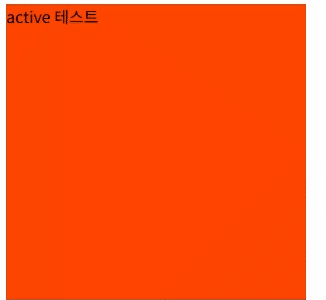

# CSS

## 1️⃣CSS 선택자


<mark style="background-color:blue;">**선택자(selector)**</mark>란?

특정한 HTML 태그를 선택할 때 사용하는 기능으로, 태그를 선택하여 원하는 스타일과 기능을 적용할 수 있다.


## CSS 선택자

### - CSS 기본 선택자

#### 모든 선택자

HTML <mark style="background-color:purple;">문서 안의 모든 태그</mark>를 선택할 때 전체 선택자를 사용할 수 있다.

<figure><figcaption></figcaption></figure>

```css
* {
   color:red;
  }
```

```html
<p>HTML 문서 안의 모든 태그를 선택할 때 전체 선택자를 사용할 수 있다.</p>
    <ul>
        <li>테스트1</li>
        <li>테스트2</li>
        <li>테스트3</li>
    </ul>
```


#### 태그 선택자

<figure><figcaption></figcaption></figure>

```css
p,li{
    color:blue;
}
```

&#x20;💡 여러 태그를 선택 할 수 있다.

```html
<p>HTML 문저 내에 같은 태그를 모두 선택할 때 사용한다.</p>
```


#### 아이디 선택자

HTML 문서 내에 해당하는 <mark style="background-color:purple;">아이디 속성의 값을 가진 태그</mark>만 선택할 때 사용한다.

💡<mark style="background-color:yellow;">아이디 선택자가 클래스 선택자보다 우선순위가 더 높다.</mark>

<figure><figcaption></figcaption></figure>

```css
 #id2{
    background: yellow;
    color: green;
}
```

```html
<ol>
 <li id = "id1">아이디 선택자 테스트1</li>
 <li id = "id2">아이디 선택자 테스트2</li>
 <li id = "id3">아이디 선택자 테스트3</li>
 <li id = "id4">아이디 선택자 테스트4</li>
 <li id = "id5">아이디 선택자 테스트5</li>
</ol>
```


#### 클래스 선택자

HTML 문서 내에 <mark style="background-color:purple;">여러 개의 태그를 동일한 클래스명으로 지정하여 선택</mark>할 때 사용한다.

<figure><figcaption></figcaption></figure>

```css
.class1 {
    background: gray;
    color:purple;
}

.class2{
    color: orangered;
}
```

```html
<ul>
  <li class = "class1" id = "id2">클래스 선택자 테스트1</li><!-- id 선택자로 css 적용한 것이 우선순위가 높다. -->
  <li class = "class2">클래스 선택자 테스트2</li>
  <li class = "class1">클래스 선택자 테스트3</li>
  <li class = "class2">클래스 선택자 테스트4</li>
  <li class = "class1">클래스 선택자 테스트5</li>
</ul>
```


### - 속성 선택자

#### 기본 속성 선택자

기본 선택자 뒤에 <mark style="background-color:yellow;">**\[]**</mark>를 사용하여 속성과 속성값을 사용한다.

(주로 id나 class 속성 아닌 것들에 적용)

<figure><figcaption></figcaption></figure>

```css
/* 속성값과 일치하는 태그, 요소 선택 */
div[name=name2]{
    background: orangered;
}

/* 속성 안의 값이 접두사로 특정 값을 단어로써 포함하는 객체 선택 */
div[name~=name1] {
    background: yellow;
}

/* 속성 안의 값이 특정 값으로 끝나는(접미사) 객체 선택 */
div[class$=class]{
    color: white
}

/* 속성 안의 값이 특정 값을 포함하는 객체 선택 */
div[class*=div]{
    background: yellow;
    color: red;
}
```

```html
<div name="name1 name5 name6" class="div-class">div 1</div>
<div name="name2" class="div-class">div 2</div>
<div name="name3" class="div-class">div 3</div>
<div name="name4" class="class-div">div 4</div>
```


#### 후손 선택자와 자손 선택자

<mark style="color:green;">자손 선택자</mark> : 바로 아래의 요소, <mark style="color:green;">후손 선택자</mark> : 하위 요소 전부

<figure><figcaption></figcaption></figure>

```css
/*자손 선택자*/
#test1>h4{
    background: hotpink;
}

/*후손 선택자*/
#test1 ul{
    background:yellow;
}

/*동일한 선택자를 또 사용해도 문제 없다.*/
#test1 ul{
    color:yellow;
}
```

```html
<div id = "test1">
    <h4>자손입니다.</h4>
    <h4>나도 자손입니다.</h4>
    <div>
        <ul id = "testul">리스트
            <li>나는 ul의 자손이면서 동시에 div의 후손입니다.</li>
            <li>나는 ul의 자손이면서 동시에 div의 후손입니다.</li>
        </ul>
    </div>
</div>
```


#### 동위 선택자

동위 관계(_형제 관계_)에서 뒤에 위치한 태그를 선택할 때 사용한다.

<figure><figcaption></figcaption></figure>

```css
/* 형제관계 선택자 (동위 선택자) */
#div-test1 {
    background: red;
}

/* 해당 요소 바로 다음에 특정 타입의 요소를 선택 */
#div-test1 + div{
    background: yellow;
}

/* 해당 요소 뒤에 있는 특정 타입의 요소 모두 선택*/
#div-test2 ~ div{
    background: purple;
} 
```

```html
<div id = "div-test1">div test1</div>
<div id = "div-test2">div test2</div>
<div id = "div-test3">div test3</div>
<div id = "div-test4">div test4</div>
<div id = "div-test5">div test5</div>
```


#### 반응 선택자

사용자의 <mark style="background-color:purple;">움직임</mark>에 따라 달라지는 선택자

```css
#active-test, #hover-test{
    width: 300px;
    height: 300px;
    background:orangered;
}
```

<figure><figcaption></figcaption></figure>

```css
#active-test:active{
    background: yellow;
    columns: white ;
}
```

```html
<div id="active-test">active 테스트</div>
```

<figure><figcaption></figcaption></figure>

```css
#hover-test:hover{
    cursor:pointer;
    background: cyan;
    columns: purple;
    font: 40px bold;
}
```

```html
<div id="hover-test">hover 테스트</div>
```


#### 상태 선택자

<mark style="background-color:purple;">입력 양식의 상태</mark>에 따라 선택되는 선택자

<figure><figcaption></figcaption></figure>

```css
/* 체크 되면 해당 양식에 따라 변경*/
input[type=checkbox]:checked{
    width: 20px;
    height: 20px;
}
```

```html
<input type="checkbox" name="frutes" value="사과" id="apple">
<label for="apple">사과</label>
<input type="checkbox" name="frutes" value="바나나" id="banana">
<label for="banana">바나나</label>
<input type="checkbox" name="frutes" value="복숭아" id="peach">
<label for="peach">복숭아</label>
```


#### 초점이 맞추어진 input 태그 선택

<figure><figcaption></figcaption></figure>

```css
/* 선택 되면 해당 양식으로 변경 */
#userId:focus, #userPwd:focus{
    background: green;
}
```

```html
<label for="userId">아이디: </label>
<input type="text" id="userId" placeholder="아이디를 입력하세요"><br>
<label for="usePwd">패스워드 : </label>
<input type="password" id = "userPwd" placeholder="비밀번호를 입력하세요">
```


#### &#x20; 사용 가능한 input 태그 선택

<figure><figcaption></figcaption></figure>

```css
option:disabled{
    background:red;
    color:white;
}

option:enabled{
    background: yellowgreen;
}

/*disable이 되면 비활성화 된다*/
input:disabled{
    background: blue;
}
```

<pre class="language-html"><code class="lang-html">&#x3C;h3>당신의 연령대는?&#x3C;/h3>
&#x3C;select>
    &#x3C;option value="10" disabled>10대&#x3C;/option>
    &#x3C;option value="20">20대&#x3C;/option>
<strong>    &#x3C;option value="30">30대&#x3C;/option>
</strong>    &#x3C;option value="40">40대&#x3C;/option>
<strong>    &#x3C;option value="50">50대&#x3C;/option>
</strong>    &#x3C;option value="60" disabled>60대&#x3C;/option>
&#x3C;/select>

&#x3C;!--disable 상태가 되면 해당 기능이 동작하지 않는다.->
&#x3C;input type="text" disabled>
&#x3C;button disabled>버튼&#x3C;/button>
</code></pre>


### - 일반 구조 선택자

<mark style="background-color:purple;">특정한 위치에 있는 태그</mark> 선택(위치로 구분)

<figure><figcaption></figcaption></figure>

```css
/* 형제 탐색 선택자들 */
/* 형제 관계 태그 중 첫 번째 태그 선택 */
#test1 :first-child {
    background: red;
    color: white;
}

/*형제 관계 태그 중 마지막 태그 선택 */
#test1 :last-child{
    background: orange;
    color:white;
}

/* 형제 관계 태그 중 앞에서 수열번 째 태그 선택 (서순 체계(1부터))*/
#test1 :nth-child(2n){
    background: skyblue;
}
```

```html
<div id = "test1">
 <p>테스트1</p>
 <p>테스트2</p>
 <p>테스트3</p>
 <p>테스트4</p>
 <p>테스트5</p>
 <pre>테스트6</pre>
</div>
```


### - 문자 선택자

<mark style="background-color:purple;">태그 내부에서 특정 조건의 문자를 선택</mark>하는 선택자

<figure><figcaption></figcaption></figure>

```css
/* 첫 번째 글자 선택*/
#test2 p:first-letter{
    font-size: 2em;
}

/* 첫 번째 줄 선택 */
#test2 p:first-line{
    background-color: coral;
}

/* 태그 뒤에 위치하는 공간을 선택 */
#test2 p:after{
    content: "@@@태그 뒤에 추가@@@";
}

/* 사용자가 드래그한 글자 선택 */
#test2 p::selection {
    background: red;
    color: white;
}
```

<pre class="language-html"><code class="lang-html">&#x3C;div  id="test2">
<strong>    &#x3C;p>Contrary to popular belief, Lorem Ipsum is not simply random text. It has roots in a piece of classical Latin literature from 45 BC, making it over 2000 years old. Richard McClintock, a Latin professor at Hampden-Sydney College in Virginia, looked up one of the more obscure Latin words, consectetur, from a Lorem Ipsum passage, and going through the cites of the word in classical literature, discovered the undoubtable source. Lorem Ipsum comes from sections 1.10.32 and 1.10.33 of "de Finibus Bonorum et Malorum" (The Extremes of Good and Evil) by Cicero, written in 45 BC. This book is a treatise on the theory of ethics, very popular during the Renaissance. The first line of Lorem Ipsum, "Lorem ipsum dolor sit amet..", comes from a line in section 1.10.32.&#x3C;/p>
</strong>&#x3C;/div>
</code></pre>


## 2️⃣선택자 우선순위

기본적으로 css 속성은 <mark style="background-color:yellow;">위에서부터 아래로 적용</mark>이 되지만, _<mark style="color:red;">같은 태그에 여러 개의 css 속성이 설정된 경우에는 우</mark><mark style="color:red;background-color:yellow;">선순위에 따라</mark> <mark style="color:red;">스타일이 적용</mark>_&#xB41C;다.


<mark style="color:purple;">태그 선택자 < 클래스 선택자 < 아이디 선택자 < 인라인 선택자 < !important</mark> 순서로 우선순위를 가진다.


<figure><figcaption></figcaption></figure>

```css
.test1{
    background: yellow;
    color: black;
}

div{
    width: 300px;
    height: 300px;
    background: darkblue;
}

#test2{
    background: plum;
}

.test2{
    background: blue !important;
}
```

```html
<div id = "test1" class = "test1">우선순위 테스트1</div>
<p id = "test2" class="test2" style="background: yellowgreen;">우선순위 테스트2</p>
```


## 3️⃣글꼴 관련 스타일

### - 웹 폰트를 사용하는 방법

🔗 [http://fonts.google.com](http://fonts.google.com)

### - font-family 속성&#x20;

텍스트의 글꼴을 지정할 때 사용한다.

<figure><figcaption></figcaption></figure>

```css
* {
  font-family: 'Franklin Gothic Medium', 'Arial Narrow', Arial, sans-serif;
}

#ff1{
   font-family: "궁서체";
}
```

```html
<p id="ff1">글꼴 변경 테스트1</p>
<p id="ff2">글꼴 변경 테스트2</p>
<p id="ff3">글꼴 변경 테스트3</p>
```


### - font-size 속성

<mark style="background-color:green;">텍스트의 크기</mark>를 변경할 때 사용한다.

<figure><figcaption></figcaption></figure>

```css
/* 크기 관련 스타일 지정 */
#size1{
    font-size:30px;
}

#size2{
    font-size:2em;
}

#size3{
    font-size:150%;
}

#size4{
    font-size:6pt;
}
```

```
<ul>
 <li id="size1">고정크기 px 테스트</li>
 <li id="size2">가변크기 em 테스트</li>
 <li id="size3">가변크기 % 테스트</li>
 <li id="size4">가변크기 pt 테스트</li>
</ul>
```


### - font-weight 속성

<mark style="background-color:green;">두꺼운 글씨</mark>를 표현할 때 사용한다.

<figure><figcaption></figcaption></figure>

```css
#fw1{
    font-weight: bold;
}

#fw2 {
    font-weight: lighter;
}

#fw3{
    font-weight: 500;
}

```

```html
<ul>
   <li id="fw1">굵은 글꼴로 변경</li>
   <li id="fw2">원래 굵기보다 더 가늘게</li>
   <li id="fw3">원래 굵기보다 더 굵게</li>
</ul>
```


### - font-variant 속성

<mark style="background-color:green;">작은 대문자</mark>로 변경할 때 사용한다.

<figure><figcaption></figcaption></figure>

```css
#fv{
   font-variant: small-caps;
 }
```

```html
<p>Hello World</p>
<p id ="fv">Hello World</p>
```

### - font-style 속성

<mark style="background-color:green;">텍스트의 기울임</mark>을 지정할 때 사용한다.

<figure><figcaption></figcaption></figure>

```css
#fs1 {
    font-style: italic;
}

#fs2{
    font-style: oblique;
}
```

```html
<ul>
  <li id="fs1">italic 기울임 글꼴</li>
  <li id="fs2">oblique 기울임 글꼴</li>
</ul>
```


### - font 속성

<mark style="background-color:green;">글꼴 관련 스타일을 한번에 지정</mark>할 때 사용한다.

<figure><figcaption></figcaption></figure>

```css
#f1{
   font: 16px "궁서체";
}

#f2{
   font: italic bold 25px "궁서체";
   color: aquamarine
 }
```

```html
<ul>
  <li id = "f1">글꼴 관련 스타일 테스트1</li>
  <li id = "f2">글꼴 관련 스타일 테스트2</li>
</ul>
```


## 4️⃣텍스트 스타일

### - color 속성

텍스트의 <mark style="background-color:green;">색상</mark>을 지정할 수 있다.

🔗 <mark style="color:green;">색상값참조사이트</mark> :  [http://www.colorpicker.com](http://www.colorpicker.com)

🔗 <mark style="color:green;">테마별 색상값 참조 사이트</mark> : [https://color.adobe.com/ko/exploreo](https://color.adobe.com/ko/exploreo)

<figure><figcaption></figcaption></figure>

```css
#c-name{
    color: red;
}

#c-16{
    color:#ff0000;
}

#c-rgb{
    color:rgb(255,0,0)
}

#c-rgba{
    color:rgba(255,0,0,0.1);
}

#c-hsl{
    color: hsl(340,100%,50%)
}

#c-hsla{
    color: hsl(340,100%,50%,0.5)
}
```

```html
<ul>
  <li id = "c-name">색상명으로 지정</li>
  <li id = "c-16">16진수 값으로 지정</li>
  <li id = "c-rgb">rgb로 지정</li>
  <li id = "c-rgba">rgba로 지정</li>
  <li id = "c-hsl">hsl로 지정</li>
  <li id = "c-hsla">hsla로 지정</li>
</ul>
```


### - text-decoration 속성&#x20;

텍스트에 <mark style="background-color:green;">줄을 긋거나 줄을 없앨 때</mark> 사용한다.

<figure><figcaption></figcaption></figure>

```css
#td1{
    text-decoration: none;
}

#td2{
    text-decoration: underline;
}

#td3 {
    text-decoration: line-through;
}

#td4 {
    text-decoration: overline;
}
```

```html
<ul>
  <li><a href="#" id="td1">하이퍼링크 밑줄 없애기</a></li>
  <li id = "td2">텍스트영역 아래 줄긋기</li>
  <li id = "td3">텍스트영역 중간에 줄긋기</li>
  <li id = "td4">텍스트영역 위에 줄긋기</li>
</ul>
```


### - text-transform 속성

영문 텍스트의 <mark style="background-color:green;">대소문자 변환</mark>시 사용한다.

<figure><figcaption></figcaption></figure>

```css
#tt1{
    text-transform: none;
}

#tt2{
    text-transform: capitalize;
}

#tt3{
    text-transform: uppercase;
}

#tt4{
    text-transform: lowercase;
}
```

<pre class="language-html"><code class="lang-html">&#x3C;ul>
<strong>  &#x3C;li id = "tt1">none&#x3C;/li>
</strong>  &#x3C;li id = "tt2">capitalize: 영문자의 첫 글자만 대문자로&#x3C;/li>
  &#x3C;li id = "tt3">uppercase : 모든 영문자를 대문자로&#x3C;/li>
  &#x3C;li id = "tt4">lowercae : 모든 영문자를 소문자로&#x3C;/li>
&#x3C;/ul>
</code></pre>
