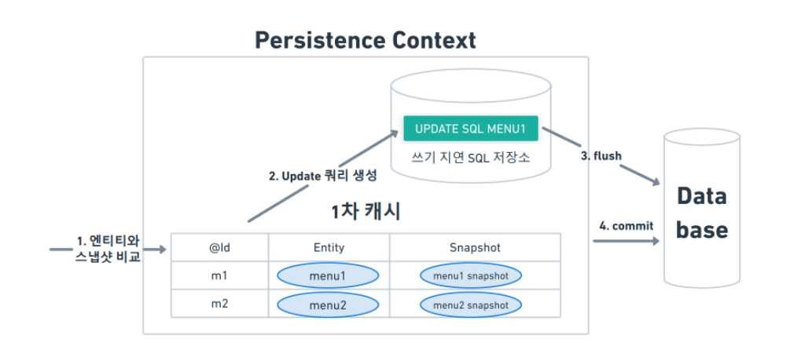

# JPA

## 1. JPA(Java Persistence API)란?

* 자바 진영의 ORM(Object Relational Mapping)  기술 표준으로 ORM 기술을 사용하기 위한 표준 인터페이스의 모음


**\[ORM] Object relational mapping** \
객체관계 매핑. 자바 플랫폼 SE와 EE를 사용하는 응용프로그램
\
에서 객체는 객체 지향적으로 설계하고 관계형 데이터베이스는 관계형 데이터베이스의 패러다임대로 설
\
계할 수 있도록 중간에서 매핑을 해주는 기술을 말한다.


## 2. JPA 특징

* 영속성 컨텍스트가 엔티티를 생명주기를 통해 관리한다.
* native SQL을 통해 직접 SQL을 해당 DB에 맞게 작성할 수 있다.
* DBMS별로 dialect를 제공한다.

<figure><figcaption></figcaption></figure>

## 3. JPA 사용 이유

### 장점

* 객체지향과 관계지향이라는 서로 다른 패러다임 불일치를 해소 -> SQL 중심이 아닌 객체지향 패러다임 중심의 개발 가능
* 개발자가 SQL을 작성해주지 않아도 SQL문을 작성해줘서 생산성 향상
* SQL을 수정할 필요가 없으므로 필드 변경시 자동으로 SQL이 수정되므로 유지보수 굳
* DB의 종류에 따라 SQL문이 있는데 JPA는 이를 자동으로 작성해준다.
* 캐시를 활용한 성능 최적화로 트랜잭션을 처리하는 시간이 단축된다.

### 단점

* 복잡한 SQL을 작성하기에는 적합하지 않다.
* JPA를 제대로 이해하지 못하고 작성시 성능 저하가 발생할 수 있다.


### MYBatis와 JPA

* Mybatis는 SQL Mapper로 SQL Mapping을 사용하는 영속성(DB저장) 프레임워크.
* JPA는 ORM 기술

## 4. JPA 원리

Java 애플리케이션과 JDBC 사이에서 동작하며 내부적으로 JDBC API를 활용.

<figure><figcaption></figcaption></figure>

JPA는 엔티티를 저장하는 환경인 영속성 컨텍스트(Persistence Context)를 통해 엔티티를 보관하고
&#x20;관리한다.

### 엔티티의 영속성 컨텍스트(Persistence Context)에서의 생명주기

<figure><figcaption></figcaption></figure>

* 엔티티 매니저가 엔티티를 저장하는 공간으로 엔티티를 보관하고 관리한다.
* 엔티티 매니저가 생성될 때 하나의 영속성 컨텍스트가 만들어 진다.

## 5. Persistence Context

<figure><figcaption></figcaption></figure>

**Persistence Context**는 엔티티를 영구 저장하는 환경으로, 엔티티 매니저를 통해 엔티티를 저장하거나 조회하면 해당 엔티티는 영속성 컨텍스트에 보관되고 관리됩니다.

### 1. 엔티티의 생명주기

```
비영속(new/transient) → 영속(managed) → 준영속(detached) → 삭제(removed)
```

### 2. 1차 캐시 (First Level Cache)

#### 1차 캐시란?

* **영속성 컨텍스트 내부에 있는 캐시**
* Map\<Key, Value> 구조로 되어 있음
* Key: @Id로 매핑한 식별자
* Value: 해당 엔티티 인스턴스

#### 1차 캐시의 동작 방식

```java
java// 엔티티를 영속성 컨텍스트에 저장 (1차 캐시에 저장됨)Member member = new Member();member.setId("member1");member.setUsername("회원1");em.persist(member);// 1차 캐시에서 조회 (SQL 쿼리 실행되지 않음)Member findMember = em.find(Member.class, "member1");
```

#### 1차 캐시의 이점

1. **성능 향상**: 같은 트랜잭션 내에서 동일한 엔티티 조회 시 DB에 접근하지 않음
2. **동일성 보장**: 같은 엔티티에 대해 항상 같은 인스턴스 반환
3. **변경 감지**: 엔티티의 변경사항을 자동으로 감지

#### 1차 캐시 조회 과정

```
1. em.find(Member.class, "member1") 호출2. 1차 캐시에서 엔티티 조회 시도3-1. 있으면: 1차 캐시에서 반환3-2. 없으면: 데이터베이스에서 조회 → 1차 캐시에 저장 → 반환
```

### 3. Flush (플러시)

#### Flush란?

**영속성 컨텍스트의 변경 내용을 데이터베이스에 반영하는 것**

* 영속성 컨텍스트를 비우는 것이 아님
* 변경 사항을 데이터베이스에 동기화하는 과정

#### Flush 동작 과정

1. **변경 감지 (Dirty Checking)**
2. **수정된 엔티티를 쓰기 지연 SQL 저장소에 등록**
3. **쓰기 지연 SQL 저장소의 쿼리를 데이터베이스에 전송**

#### Flush 발생 시점

```java
java// 1. 직접 호출em.flush();// 2. 트랜잭션 커밋 시 자동 호출transaction.commit();// 3. JPQL 쿼리 실행 시 자동 호출List<Member> members = em.createQuery("select m from Member m", Member.class)                        .getResultList();
```

#### Flush 모드 설정

```java
java// AUTO: 커밋이나 쿼리 실행 시 플러시 (기본값)em.setFlushMode(FlushModeType.AUTO);// COMMIT: 커밋할 때만 플러시em.setFlushMode(FlushModeType.COMMIT);
```

### 4. Commit (커밋)

#### Commit이란?

**트랜잭션의 변경 사항을 데이터베이스에 영구적으로 반영하는 것**

#### Commit 과정

```java
javaEntityTransaction transaction = em.getTransaction();transaction.begin(); // 트랜잭션 시작// 엔티티 등록Member member = new Member("member1", "회원1");em.persist(member);// 엔티티 수정member.setUsername("수정된회원1");transaction.commit(); // 트랜잭션 커밋
```

#### Commit 시 내부 동작

1. **Flush 자동 호출**
2. **실제 데이터베이스 트랜잭션 커밋**
